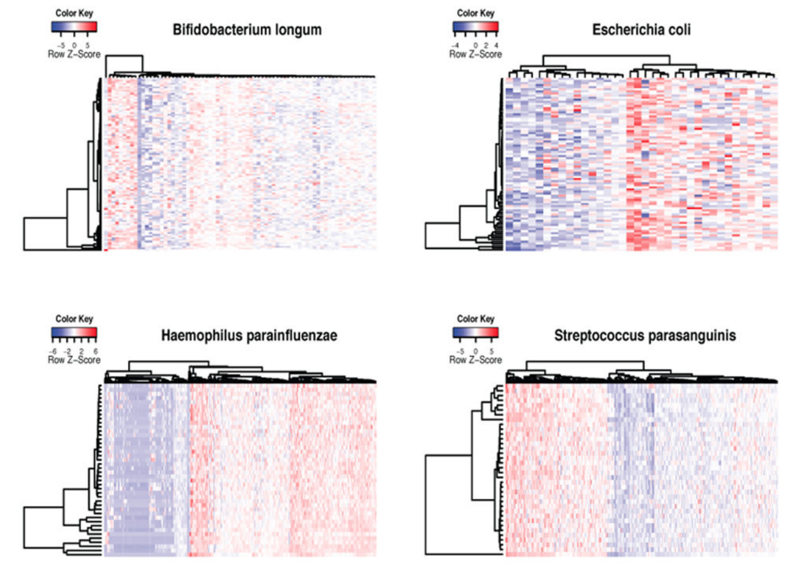
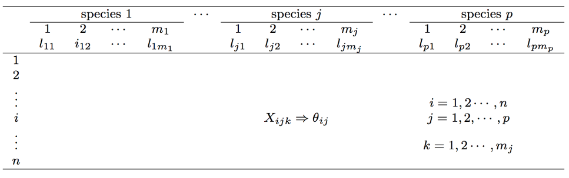
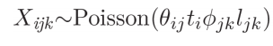
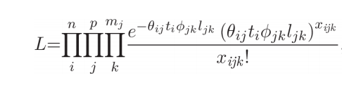

# MSSQ
Multi-Sample Poisson Model for Species Abundance Quantification

## Introduction
The human microbiome, which includes the collective microbes residing in or on the human body, has a profound influence on the human health. DNA sequencing technology has made the large-scale human microbiome studies possible by using shotgun metagenomic sequencing. One important aspect of data analysis of such metagenomic data is to quantify the bacterial abundances based on the metagenomic sequencing data. Existing methods almost always quantify such abundances one sample at a time, which ignore certain systematic differences in read coverage along the genomes due to GC contents, copy number variation and the bacterial origin of replication. 

In order to account for such differences in read counts, we propose a multi-sample Poisson model to quantify microbial abundances based on read counts that are assigned to species-specific taxonomic markers. Our model takes into account the marker-specific effects when normalizing the sequencing count data in order to obtain more accurate quantification of the species abundances. Compared to currently available methods on simulated data and real data sets, our method has demonstrated an improved accuracy in bacterial abundance quantification, which leads to more biologically interesting results from downstream data analysis.


<p align="center">
  
</p>
The above figure shows the marker effects in the shotgun metagenomic data for four bacterial species. The raw sequencing reads were first aligned to the taxonomic markers and then normalized as the number of aligned reads for each marker divided by marker length and total number of aligned reads for each sample. The normalized data was then clustered and showed in heatmap. The rows are samples and columns are taxonomic markers from MetaPhlAn.


## Installation
You can install our MSSQ package from Github
```r
install.packages("devtools")
devtools::install_github("chvlyl/MSSQ")
library(MSSQ)
```

## Basic Usage
```r
est <- poisson_estimate_parameter_LS(X=X,tc=tc,l=l,N=N,S=S,
                                  species.names=species.names,
                                  estimate.phi=TRUE)
```

Before using MSSQ, you need to prepare your data into the following format (I parsed the MetaPhlAn output, i.e the read counts per marker, to get such table).
<p align="center">
  
</p>

X: is a matrix, which is just the above table. Note that each value is the read counts aligned to each marker.

tc: is a vector, which is the total counts for each sample or the total reads aligned to all the markers. The difference is that the former one including those unaligned read counts. I experimented both and it seems to me the latter one is better. The length of tc should be as the same as the nrow of X.

l: is a vector, which is the length of each marker. The length of l should be as the same as the ncol of X. Note that the l should be normalized (for example, l/1000000). Otherwise, ϕ_ij will be very small. 

N: is a scalar, which is the total number of samples

S: is a scalar, which is the total number of species

species.names: is a vector, which is the species name for each marker. The length should be as the same as the ncol of X.

## Model Details
Consider a metagenomic study with N samples. After the sequencing reads are aligned to
sets of clade-specific marker genes, the data can be summarized as a large table of counts, where X_ijk is the count data of sequencing reads for sample i (i = 1, 2, …, n), species j (j = 1, 2, …, p) and marker k (k = 1, 2, …, m_j). We model the count data for all species and all samples together and assume that the count X_ijk is generated from the following Poisson model,

<p align="center">
  
</p>

where θ_ij > 0 is the relative abundance for the jth species in the ith sample. In common practice, the bacterial abundance are usually transformed into relative abundances (i.e. the bacterial abundance sum to 100% in one sample). We therefore impose that .
This constraint also avoids the identifiability issue in the model. Here t_i is the total read counts for sample i that are mapped to the marker genes and l_jk is the length of the kth marker gene for jth species. Note that the species may have different number of markers. t_i and l_jk are known or can be calculated from the data directly. The parameters ϕ_jk > 0 (j = 1,⋯, p and k = 1, ⋯, mj) are used to model the marker-specific effects for the set of marker genes. The marker-specific effect can be due to different GC contents, mappability and possible lateral gene transfers. Note that although the marker length parameters l_jk do not
affect the estimates of θ_ij, including l_jk in the model makes the values of ϕ_jk comparable across markers and more interpretable. In fact, the variability of ϕ_jk across all m_j marker genes for a given species j can have an important biological meaning, as we demonstrate in our real data analysis. 

For a given species j, each sample i has its own relative abundance θ_ij. The data X_ijk (k = 1, ⋯, m_j) that we use to estimate θ_ij, are assumed to follow a Poisson distribution. However, we allow each marker gene (k) to have its own effect, therefore, this actually accounts for possible overdispersion observed in the data. Our model uses data from multiple samples to estimate the marker effects ϕ_jk. When ϕ_jk = 1, our model is a Poisson model without considering the marker effects, which is essentially the approach used by MetaPhlAn.

We fit the model and estimate the parameter using the maximum likelihood estimation, where the likelihood function is
<p align="center">
  
</p>
Estimates θ and ϕ can be obtained iteratively. 


## Citation
Eric Z. Chen, Frederic D. Bushman and Hongzhe Li (2017). A Model-Based Approach For Species Abundance Quantification Based On Shotgun Metagenomic Data. [Stat Biosci](https://www.ncbi.nlm.nih.gov/pmc/articles/PMC5612490/pdf/nihms792800.pdf)

## Problem
1. If the input table has too many zeros, the MSSQ may not converge. I would suggest users to filter out low count species and samples before fitting MSSQ. 
